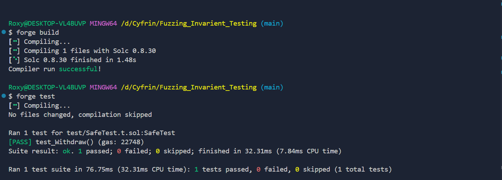

## Fuzz Testing
Forge supports property based testing.

Property-based testing is a way of testing general behaviors as opposed to isolated scenarios.

Let's examine what that means by writing a unit test, finding the general property we are testing for, and converting it to a property-based test instead:

# Test Result:


This unit test does test that we can withdraw ether from our safe. However, who is to say that it works for all amounts, not just 1 ether?

The general property here is: given a safe balance, when we withdraw, we should get whatever is in the safe.

Forge will run any test that takes at least one parameter as a property-based test, so let's rewrite:

If we run the test now, we can see that Forge runs the property-based test, but it fails for high values of amount:

# Test Result: default Fuzz runs
.PNG)

The default amount of ether that the test contract is given is 2**96 wei (as in DappTools), so we have to restrict the type of amount to uint96 to make sure we don't try to send more than we have:

# Test Result: default Fuzz runs
UINT96.PNG)

You may want to exclude certain cases using the assume cheatcode. In those cases, fuzzer will discard the inputs and start a new fuzz run:

# Test Result: default Fuzz runs
UINT96.PNG)

# Test Result: Fuzz test with 1000 runs and seed 0x2

1000RUNs.PNG)

# Test Result: Fuzz test with 10000 runs and seed 0x2
10000RUNs.PNG)

# Test Result: Fuzz test with 25000 runs and seed 0x2
25000RUNs.PNG)

# Test Result: Fuzz test with 65536 runs and seed 0x2
65536RUNs.PNG)

## Fuzz test fixtures
Fuzz test fixtures can be defined when you want to make sure a certain set of values is used as inputs for fuzzed parameters. These fixtures can be declared in tests as:

storage arrays prefixed with fixture and followed by param name to be fuzzed. For example, fixtures to be used when fuzzing parameter amount of type uint32 can be defined as

```javascript
uint32[] public fixtureAmount = [1, 5, 555];
```

functions named with fixture prefix, followed by param name to be fuzzed. Function should return an (fixed size or dynamic) array of values to be used for fuzzing. For example, fixtures to be used when fuzzing parameter named owner of type address can be defined in a function with signature

```javascript
function fixtureOwner() public returns (address[] memory)
```

If the type of value provided as a fixture is not the same type as the named parameter to be fuzzed then it is rejected and an error is raised.

An example where fixture could be used is to reproduce the DSChief vulnerability. Consider the 2 functions

```javascript
    function etch(address yay) public returns (bytes32 slate) {
        bytes32 hash = keccak256(abi.encodePacked(yay));
 
        slates[hash] = yay;
 
        return hash;
    }
 
    function voteSlate(bytes32 slate) public {
        uint weight = deposits[msg.sender];
        subWeight(weight, votes[msg.sender]);
        votes[msg.sender] = slate;
        addWeight(weight, votes[msg.sender]);
    }
```

where the vulnerability can be reproduced by calling voteSlate before etch, with slate value being a hash of yay address. To make sure fuzzer includes in the same run a slate value derived from a yay address, following fixtures can be defined:

```javascript
        address[] public fixtureYay = [
        makeAddr("yay1"),
        makeAddr("yay2"),
        makeAddr("yay3")
    ];
 
    bytes32[] public fixtureSlate = [
        keccak256(abi.encodePacked(makeAddr("yay1"))),
        keccak256(abi.encodePacked(makeAddr("yay2"))),
        keccak256(abi.encodePacked(makeAddr("yay3")))
    ];

```

